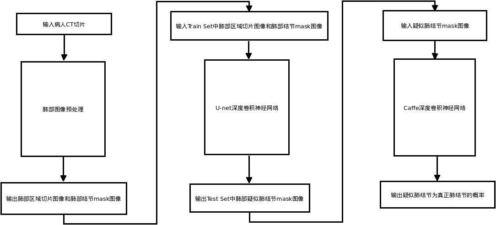

# Deep Learning Tutorial for Pulmonary Nodules Segmentation, using Keras

## 天池医疗AI大赛[第一季]：U-Net训练基于卷积神经网络的肺结节分割器
> ##### @author Jeniffer Wu

> As I received some emails from the readers about the "pulmonary nodule intelligent diagnosis" project on my Github these days, I have written to answer some of these questions.
[Letters to readers](https://github.com/JenifferWuUCLA/pulmonary-nodules-segmentation/blob/master/Letters%20to%20readers.pdf)

> I have answered the questions of intelligent diagnosis of pulmonary nodules
[Questions and answers](https://github.com/JenifferWuUCLA/pulmonary-nodules-segmentation/blob/master/Questions%20and%20answers.pdf)

##### See picture below(肺癌检测系统框图)



##### See picture below(Fig. Extracting the mask of the nodules and training the network on the Segmented lungs)


#### Lung nodule prediction error:
>##### 

This tutorial shows how to use [Keras library](http://keras.io/) to build deep neural network for pulmonary nodules image segmentation.

This deep neural network achieves **~0.57 score on the leaderboard** based on test images,
and can be a good staring point for further, more serious approaches.

The architecture was inspired by [U-Net: Convolutional Networks for Biomedical Image Segmentation](http://lmb.informatik.uni-freiburg.de/people/ronneber/u-net/).

---

- using Keras 2
- using TF backend instead of Theano
- using scikit-image instead of cv2
- added code for saving predicted images to disk 
- training data is now split into train/validation data (80%/20%)

---

## Overview

### Data

Train and test data set in built by ```tianchi```, and the .mhd is processed by ```*_dataset_mask_extraction.py```, ```*_dataset_segment_lung_ROI.py```, ```*_dataset_preprocessing_2DUnet.py``` script.
This script just loads the images and saves them into NumPy binary format files **.npy** for faster loading later.

### Pre-processing

The images are not pre-processed in any way, except resizing to 512 x 512. Since the images are pretty noisy,
I expect that some thoughtful pre-processing could yield better performance of the model.

Output images (masks) are scaled to \[0, 1\] interval.

### Model

The provided model is basically a convolutional auto-encoder, but with a twist - it has skip connections from encoder layers to decoder layers that are on the same "level".
See picture below (note that image size and numbers of convolutional filters in this tutorial differs from the original U-Net architecture).


This deep neural network is implemented with Keras functional API, which makes it extremely easy to experiment with different interesting architectures.

Output from the network is a 512 x 512 which represents mask that should be learned. Sigmoid activation function
makes sure that mask pixels are in \[0, 1\] range.

### Training

The model is trained for 20 epochs, where each epoch took ~30 seconds on Titan X. Memory footprint of the model is ~800MB.

After 20 epochs, calculated Dice coefficient is ~0.68, which yielded ~0.57 score on leaderboard, so obviously this model overfits (cross-validation pull requests anyone? ;)).

Loss function for the training is basically just a **negative of Dice coefficient**
(which is used as [evaluation metric on the competition](https://www.kaggle.com/c/ultrasound-nerve-segmentation/details/evaluation)),
and this is implemented as custom loss function using Keras backend - check ```dice_coef()``` and ```dice_coef_loss()``` functions in ```deep_learning_2DUnet.py```, ```deep_learning_unet.py``` for more detail.
Also, for making the loss function smooth, a factor ```smooth = 1``` factor is added.

The weights are updated by Adam optimizer, with a 1e-5 learning rate. During training, model's weights are saved in HDF5 format.

---

## How to use

### Dependencies

This tutorial depends on the following libraries:

* scikit-image
* Tensorflow
* Keras >= 2.0

Also, this code should be compatible with Python versions 2.7-3.5.

### Prepare the data

In order to extract raw images and save them to *.npy* files, you should first prepare its structure. 
* Now run ```python *_dataset_mask_extraction.py```, ```*_dataset_segment_lung_ROI.py``` or ```*_dataset_preprocessing_2DUnet.py```.

Running this script will create train and test images and save them to **.npy** files.

### Define the model

* Check out ```get_unet()``` in ```deep_learning_2DUnet.py``` to modify the model, optimizer and loss function.

### Train the model and generate masks for test images

* Run ```python deep_learning_2DUnet.py``` to train the model.

Check out ```train_predict()``` to modify the number of iterations (epochs), batch size, etc.

After this script finishes, in ```imgs_mask_test.npy``` masks for corresponding images in ```imgs_test.npy```
should be generated. I suggest you examine these masks for getting further insight of your model's performance.

### Generate submission

* Run ```python generate_submission.py``` to generate the submission file ```submission.csv``` for the generated masks.

Check out function ```submission()``` and ```run_length_enc()``` (thanks woshialex) for details.

### Authors
Pulmonary-nodules-segmentation is designed and implemented by Yingyi Wu  <yywu@szucla.org>.


## About Keras

Keras is a minimalist, highly modular neural networks library, written in Python and capable of running on top of either TensorFlow or Theano. It was developed with a focus on enabling fast experimentation. Being able to go from idea to result with the least possible delay is key to doing good research.

Use Keras if you need a deep learning library that:

allows for easy and fast prototyping (through total modularity, minimalism, and extensibility).
supports both convolutional networks and recurrent networks, as well as combinations of the two.
supports arbitrary connectivity schemes (including multi-input and multi-output training).
runs seamlessly on CPU and GPU.
Read the documentation [Keras.io](http://keras.io/)

Keras is compatible with: Python 2.7-3.5.